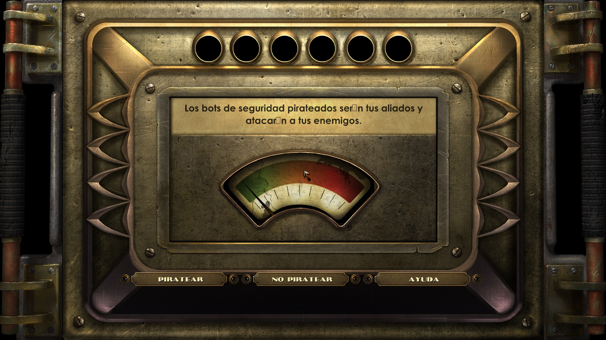

# BioshockLocalizedespFix
Fix for Bioshock Remastered Spanish Localization

## The problem

It seems that the font used in 'hacking' terminals does not support non ASCII characters. 

## How to

1. Go to '%steamapps%\common\BioShock Remastered\ContentBaked\pc
2. Backup 'Localizedesp.lbf'
3. Replace 'Localizedesp.lbf' with the one in the one provided in this page. 
